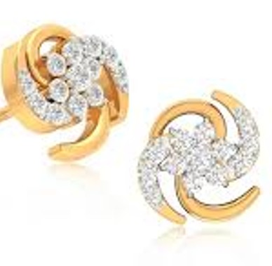
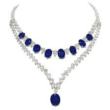

<!DOCTYPE html>
<html>
<head>
<title>Jewelry Fashion</title>

</head>
<body>

   <marquee behavior="slide" direction="up" scrollamount="1">
   
   </marquee> 
<a href="https://goldprice.org/">Cambodia Natural Gemstones</a>  
<h1 style="color:Gold;background-color:#212f3c;"><marquee behavior="scroll" direction="right" scrollamount="8">Cambodia Natural Gemstones </marquee> </h1> <em>

Our team of design consultants guides you through each step of designing the perfect ring. Get expert advice and guidance on your diamond or gemstone choice and ring design. Free Sketch Design. Diamond jewellery Diamond Jewelry Set Diamond Jewelry Designs Diamond Bracelet Design Diamond Bracelet Gold Bracelet Simple Gold Bracele 

<h2 style="color:Gold;background-color:#212f3c;">Gold 999</h2>

Gold Cast Bar 1 Kg (999.9) Gold Grain 1000 Grams (995.0) (999.9) Purity Pure gold has 24 carats - that is, 24/24 parts by weight of gold - and thus a fineness of 999.9(999.9 thousand
parts). Some mints and mints

 <h2>Cambodia Gold 99.99</h2>

    

     
    
Natural Cambodia MIne

    

 

    

     
    
Gold 9999

    

    

     
    
Natural Gold

    

    
	
     	
    
Gold Make in Cambodia
	
    
	

    
	
	

<h2 style="color:Gold;background-color:#212f3c;">Natural diamond</h2>

Most natural diamonds have ages between 1 billion and 3.5 billion years. Most were formed at depths between 150 and 250 kilometres (93 and 155 mi) Natural Diamonds is the destination
for all things natural diamonds. Get diamond style & engagement ring inspiration

 <h2>Natural diamond</h2>

    

     
    
Natural Pink Diamond

    

    

     
    
Natural Brows Diamond

    
	

    

     
    
Natural Blue Diamond

    

	

    

     
    
Natural color Diamond

   
	

    
	
	

<h2 style="color:Gold;background-color:#212f3c;">Ring</h2>

Necklaces, Bracelets, Earrings, Rings, Anklets.High-Quality Jewellery For Women - Personalised Jewellery Quality Guaranteed. Free Worldwide Shipping.

 <h2>Rings</h2>

    

     
    
Natural Diamond Ring

    

	

    

     
    
Natural Pailin Sapphier

    

	

    

     
    
Natural Pailin Rubby

    

    

     
    
Gold 75% Ring

    

    
	
	

<h2 style="color:Gold;background-color:#212f3c;">Earring</h2>

Meet timeless, twinkling drop earrings, gold hoop earrings, and more ade to mix, match, and inspire. From a simple, sparkly studs earring to stackable gold Earrings are one of the most
timeless and versatile pieces of jewelry. They have been worn by women for centuries and have evolved into a must-have accessory

 <h2>Ear rings</h2>

	

    

     
    
Cambodian Ear Rings

    

	

    

     
    
New Design Ear Rings

    

	

    

     
    
Ear Rings For Lady

    

	

    

     
    
Old Style Ear Rings

    

			

    
	
	

<h2 style="color:Gold;background-color:#212f3c;">Necklace</h2>

Discover our Range of Diamond Bracelets. Timeless Bespoke In-house and International Designs. Luxury Specialists. Bridal Jewellery. Specialty Diamonds. Exclusive Collections. Iconic
Jewellery

 <h2>Necklace</h2>

    

     
    
Cambodian Necklace

    

			

    

     
    
Gold Cambodian Necklace

    

			

    

     
    
Sapphier Necklace

    

			

    

     
    
Natural Gemstone Necklace

    

			

    
	
	

<h2 style="color:Gold;background-color:#212f3c;">Bracelet</h2>	

 <h2>Bracelet</h2>

    

     
    
Gold Bracelet

    

				

    

     
    
Bracelet Pailin Sapphier

    

				

    

     
    
Bracelet Pailin Rubby

    

				

    

     
    
Bracelet Diamond

    

				
	

    
	
	

<h2 style="color:Gold;background-color:#212f3c;">Anklet</h2>	

Some of the popular anklets for women available on Etsy include: anklets for women sterling silver, anklets for women boho, anklets for women beach, toe rings

 <h2>Anklet</h2>

	

    

     
    
Gold Anklet for Kids

    

    

     
    
Cambodia Anklet for Lady

    

    

     
    
Gold Anklet Women

    

    

     
    
Anklet 75% for Lady

    

   <footer>
   

   <h1>
   Tel: 077778647-070778647
   Telegram: @teavchhunnan
    ABA QR
	</h1>
	

        
   </footer>
</html>
